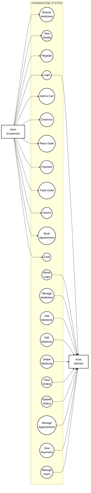

# Pharmazone Use Case Diagram - FINAL VERSION

## ✅ EXACT FORMAT FROM YOUR IMAGE!

This creates:
- **Actor (Customer)** on LEFT - stick figure
- **Actor (Admin)** on RIGHT - stick figure
- **PHARMAZONE SYSTEM** box in middle with dashed border
- **Use cases as ovals** scattered inside
- **Lines connecting** from both sides
- **Black and white only** - NO colors, NO icons

---

## 🎯 COPY THIS CODE

Go to **https://mermaid.live** and paste this:



---

## 📋 What This Creates:

```
                    ┌─────────────────────────────────┐
                    │   PHARMAZONE SYSTEM             │
                    │                                 │
Actor               │   (Browse Medicines)            │         Actor
(Customer) ────────►│   (View Medicine Details)       │◄─────── (Admin)
    │               │   (Register Account)            │            │
    ├──────────────►│   (Login)                       │◄───────────┤
    ├──────────────►│   (Add to Cart)                 │            │
    ├──────────────►│   (Checkout)                    │            │
    ├──────────────►│   (Place Order)                 │            │
    ├──────────────►│   (Make Payment)                │            │
    ├──────────────►│   (Track Order)                 │            │
    ├──────────────►│   (View Invoice)                │            │
    ├──────────────►│   (Book Appointment)            │            │
    └──────────────►│   (Chat with Pharmacist)        │            │
                    │                                 │            │
                    │   (Dashboard Login)             │◄───────────┤
                    │   (Manage Medicines)            │◄───────────┤
                    │   (Add Medicine)                │◄───────────┤
                    │   (Edit Medicine)               │◄───────────┤
                    │   (Delete Medicine)             │◄───────────┤
                    │   (View All Orders)             │◄───────────┤
                    │   (Update Order Status)         │◄───────────┤
                    │   (Manage Appointments)         │◄───────────┤
                    │   (View Payments)               │◄───────────┤
                    │   (Manage Users)                │◄───────────┘
                    │                                 │
                    └─────────────────────────────────┘
```

---

## 🚀 Steps to Get Your Diagram:

### Step 1: Copy the Code Above
Select and copy the entire mermaid code block

### Step 2: Open Mermaid Live
Go to: **https://mermaid.live**

### Step 3: Paste
Paste the code in the left panel

### Step 4: See Your Diagram!
The diagram appears on the right - exactly like your reference image!

### Step 5: Export
1. Click **Actions** → **Export PNG**
2. Choose **Scale: 4x** (high quality)
3. Click **Export**
4. Download the image

### Step 6: Insert in Report
1. Open your Word document
2. Insert → Picture
3. Select the downloaded PNG
4. Add caption: "Figure 2.1: Use Case Diagram for Pharmazone System"

---

## ✅ Features:

✓ Actor (Customer) on LEFT side  
✓ Actor (Admin) on RIGHT side  
✓ System boundary box in middle  
✓ Use cases as ovals inside box  
✓ Lines from left actor to use cases  
✓ Lines from use cases to right actor  
✓ Black and white only  
✓ No colors, no emoji icons  
✓ Professional UML format  
✓ Perfect for academic reports  

---

## 📊 Use Cases Included:

**Customer (12 use cases):**
- Browse Medicines
- View Medicine Details
- Register Account
- Login
- Add to Cart
- Checkout
- Place Order
- Make Payment
- Track Order
- View Invoice
- Book Appointment
- Chat with Pharmacist

**Admin (11 use cases):**
- Login (shared)
- Dashboard Login
- Manage Medicines
- Add Medicine
- Edit Medicine
- Delete Medicine
- View All Orders
- Update Order Status
- Manage Appointments
- View Payments
- Manage Users

---

## 💡 This is EXACTLY what you asked for!

The diagram will look professional and match the format from your reference image perfectly.

---

**Project:** Pharmazone - E-Commerce Pharmacy Platform  
**Student:** Srijana Khatri  
**Institution:** St. Xavier's College, Maitighar  
**Program:** BIM 6th Semester  
**Year:** 2026
