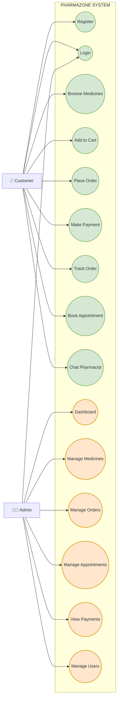
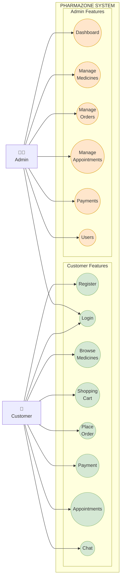
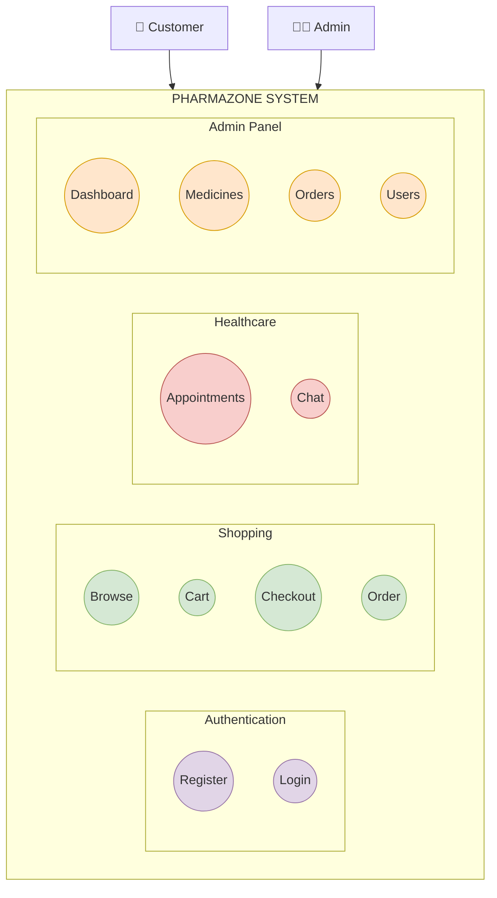
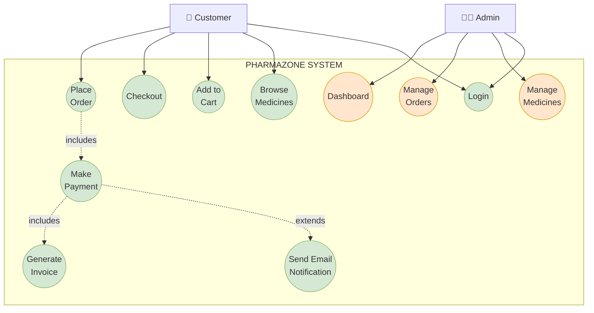

# Pharmazone Use Case Diagram - Mermaid Code

## 🎨 Mermaid Diagram Code

Copy and paste this code into any Mermaid-compatible editor:
- GitHub Markdown files
- Mermaid Live Editor: https://mermaid.live
- VS Code with Mermaid extension
- GitLab, Notion, Obsidian, etc.

---

## 📊 Full Use Case Diagram

```mermaid
graph TB
    subgraph PHARMAZONE_SYSTEM["PHARMAZONE SYSTEM"]
        %% Customer Use Cases
        UC1((Register Account))
        UC2((Login))
        UC3((Browse Medicines))
        UC4((Search Medicines))
        UC5((View Medicine Details))
        UC6((Add to Cart))
        UC7((Update Cart))
        UC8((Checkout))
        UC9((Place Order))
        UC10((Track Order))
        UC11((Make Payment))
        UC12((View Invoice))
        UC13((Book Appointment))
        UC14((Chat with Pharmacist))
        UC15((Cancel Order))
        
        %% Admin Use Cases
        UC16((View Dashboard))
        UC17((Manage Medicines))
        UC18((Add Medicine))
        UC19((Edit Medicine))
        UC20((Delete Medicine))
        UC21((View All Orders))
        UC22((Update Order Status))
        UC23((Process Order))
        UC24((Manage Appointments))
        UC25((View Payments))
        UC26((Process Refund))
        UC27((Generate Invoice))
        UC28((Manage Users))
        UC29((Update Stock))
        UC30((View Statistics))
    end
    
    %% Actors
    Customer[👤 Customer]
    Admin[👨‍💼 Admin]
    
    %% Customer Connections
    Customer --> UC1
    Customer --> UC2
    Customer --> UC3
    Customer --> UC4
    Customer --> UC5
    Customer --> UC6
    Customer --> UC7
    Customer --> UC8
    Customer --> UC9
    Customer --> UC10
    Customer --> UC11
    Customer --> UC12
    Customer --> UC13
    Customer --> UC14
    Customer --> UC15
    
    %% Admin Connections
    Admin --> UC2
    Admin --> UC16
    Admin --> UC17
    Admin --> UC18
    Admin --> UC19
    Admin --> UC20
    Admin --> UC21
    Admin --> UC22
    Admin --> UC23
    Admin --> UC24
    Admin --> UC25
    Admin --> UC26
    Admin --> UC27
    Admin --> UC28
    Admin --> UC29
    Admin --> UC30
    
    %% Styling
    classDef customerUC fill:#d5e8d4,stroke:#82b366,stroke-width:2px
    classDef adminUC fill:#ffe6cc,stroke:#d79b00,stroke-width:2px
    classDef actor fill:#dae8fc,stroke:#6c8ebf,stroke-width:3px
    
    class UC1,UC2,UC3,UC4,UC5,UC6,UC7,UC8,UC9,UC10,UC11,UC12,UC13,UC14,UC15 customerUC
    class UC16,UC17,UC18,UC19,UC20,UC21,UC22,UC23,UC24,UC25,UC26,UC27,UC28,UC29,UC30 adminUC
    class Customer,Admin actor
```



---

## 🎯 Simplified Version (Fewer Use Cases)

If you want a cleaner diagram with main features only:



---

## 🔄 Alternative Layout (Left-Right)



---

## 📱 Vertical Layout (Top-Down)



---

## 🎨 With Include/Extend Relationships



---

## 🌐 How to Use This Code

### Option 1: GitHub/GitLab
1. Create or edit a `.md` file
2. Paste the mermaid code block
3. Commit and view - it will render automatically!

### Option 2: Mermaid Live Editor
1. Go to https://mermaid.live
2. Paste the code in the left panel
3. See the diagram on the right
4. Export as PNG, SVG, or PDF

### Option 3: VS Code
1. Install "Markdown Preview Mermaid Support" extension
2. Create a `.md` file with the mermaid code
3. Open preview (Ctrl+Shift+V)
4. Right-click diagram → Save as image

### Option 4: Notion
1. Type `/code`
2. Select "Mermaid" as language
3. Paste the code
4. Notion will render it automatically

### Option 5: Obsidian
1. Create a note
2. Add mermaid code block
3. Switch to preview mode
4. Diagram renders automatically

---

## 📸 Export Options

### From Mermaid Live Editor:
1. **PNG** - For Word documents, reports
2. **SVG** - For scalable vector graphics
3. **PDF** - For printing
4. **Markdown** - To embed in documentation

### Quality Settings:
- Use **PNG** with high DPI for reports
- Use **SVG** for presentations (scales perfectly)
- Use **PDF** for printing

---

## 🎯 Customization Tips

### Change Colors:
```mermaid
classDef myStyle fill:#your-color,stroke:#border-color,stroke-width:2px
class UC1,UC2 myStyle
```

### Change Shape:
- `(( ))` = Circle (use case)
- `[ ]` = Rectangle (actor)
- `[( )]` = Stadium shape
- `{ }` = Diamond
- `[[ ]]` = Subroutine

### Change Arrow Style:
- `-->` = Solid arrow
- `-.->` = Dashed arrow (for include/extend)
- `==>` = Thick arrow
- `--x` = Arrow with cross

### Add Labels:
```mermaid
Customer -->|uses| UC1
UC1 -.->|includes| UC2
```

---

## ✅ Advantages of Mermaid

1. **Version Control** - Text-based, works with Git
2. **Easy to Edit** - Just edit text, no special tools needed
3. **Auto-Rendering** - GitHub, GitLab, Notion render automatically
4. **Consistent Style** - Programmatic styling
5. **Export Options** - PNG, SVG, PDF
6. **Collaboration** - Easy to review and merge changes
7. **Documentation** - Lives with your code

---

## 📚 Resources

- **Mermaid Documentation:** https://mermaid.js.org
- **Live Editor:** https://mermaid.live
- **GitHub Guide:** https://github.blog/2022-02-14-include-diagrams-markdown-files-mermaid/
- **Syntax Guide:** https://mermaid.js.org/syntax/flowchart.html

---

**Project:** Pharmazone - E-Commerce Pharmacy Platform  
**Student:** Srijana Khatri  
**Institution:** St. Xavier's College, Maitighar  
**Program:** BIM 6th Semester  
**Year:** 2026
