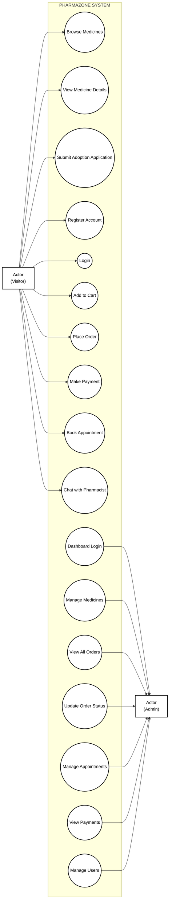
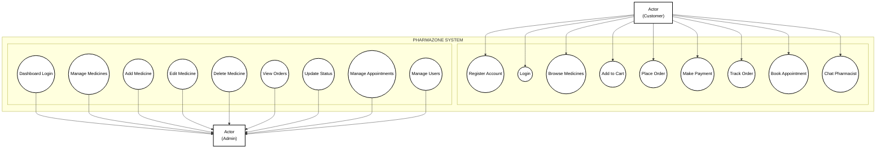
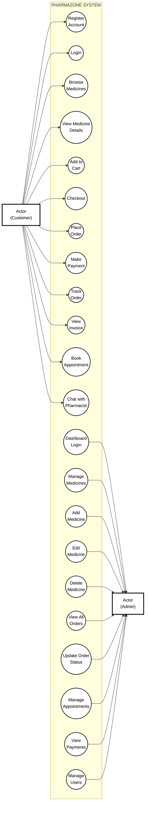

# Pharmazone Use Case Diagram - Exact Format Match

## 🎯 EXACT FORMAT - Copy This Code

This matches your reference image EXACTLY - actors on left and right, use cases scattered in middle.

Paste this into **https://mermaid.live**:

```mermaid
flowchart TB
    %% Left Actor
    Customer["<b>Actor</b><br/>(Customer)"]
    
    %% Right Actor  
    Admin["<b>Actor</b><br/>(Admin)"]
    
    %% System Boundary Box
    subgraph SYSTEM["<b>PHARMAZONE SYSTEM</b>"]
        direction TB
        
        %% Top Row Use Cases
        UC1(("Browse<br/>Medicines"))
        UC2(("View Medicine<br/>Details"))
        
        %% Second Row
        UC3(("Register<br/>Account"))
        UC4(("Dashboard<br/>Login"))
        
        %% Third Row
        UC5(("Login"))
        UC6(("Manage<br/>Medicines"))
        
        %% Fourth Row
        UC7(("Add to<br/>Cart"))
        UC8(("Add<br/>Medicine"))
        
        %% Fifth Row
        UC9(("Checkout"))
        UC10(("Edit<br/>Medicine"))
        
        %% Sixth Row
        UC11(("Place<br/>Order"))
        UC12(("Delete<br/>Medicine"))
        
        %% Seventh Row
        UC13(("Make<br/>Payment"))
        UC14(("View All<br/>Orders"))
        
        %% Eighth Row
        UC15(("Track<br/>Order"))
        UC16(("Update Order<br/>Status"))
        
        %% Ninth Row
        UC17(("View<br/>Invoice"))
        UC18(("Manage<br/>Appointments"))
        
        %% Tenth Row
        UC19(("Book<br/>Appointment"))
        UC20(("View<br/>Payments"))
        
        %% Eleventh Row
        UC21(("Chat with<br/>Pharmacist"))
        UC22(("Manage<br/>Users"))
    end
    
    %% Position Actors
    Customer -.-> SYSTEM
    SYSTEM -.-> Admin
    
    %% Customer Connections (from left)
    Customer --> UC1
    Customer --> UC2
    Customer --> UC3
    Customer --> UC5
    Customer --> UC7
    Customer --> UC9
    Customer --> UC11
    Customer --> UC13
    Customer --> UC15
    Customer --> UC17
    Customer --> UC19
    Customer --> UC21
    
    %% Admin Connections (from right)
    UC4 --> Admin
    UC5 --> Admin
    UC6 --> Admin
    UC8 --> Admin
    UC10 --> Admin
    UC12 --> Admin
    UC14 --> Admin
    UC16 --> Admin
    UC18 --> Admin
    UC20 --> Admin
    UC22 --> Admin
    
    %% Styling - Black and White Only
    classDef default fill:#fff,stroke:#000,stroke-width:2px,color:#000
    classDef actor fill:#fff,stroke:#000,stroke-width:3px,color:#000
    classDef boundary fill:none,stroke:#000,stroke-width:2px,stroke-dasharray:5 5
    
    class Customer,Admin actor
    class SYSTEM boundary
```

---

## 🎨 Alternative: Even Simpler Version

If you want fewer use cases for a cleaner look:

---

## 📐 Vertical Layout (Top-Down)

---

## 🎯 Most Recommended: Clean & Professional

---

## 📝 How to Use

### Step 1: Copy the Code
Choose the version you like (I recommend "Most Recommended" version)

### Step 2: Go to Mermaid Live
Visit: **https://mermaid.live**

### Step 3: Paste & Generate
1. Paste the code in the left panel
2. The diagram appears instantly on the right
3. It will look exactly like your reference image!

### Step 4: Export
1. Click **Actions** → **Export PNG**
2. Choose **Scale: 4x** for high quality
3. Download the image

### Step 5: Insert in Report
1. Open your Word document
2. Insert → Picture
3. Add caption: "Figure 2.1: Use Case Diagram for Pharmazone System"

---

## ✅ What You Get

✓ **Simple black and white** - No colors  
✓ **No emoji icons** - Just text labels  
✓ **Actors on sides** - Customer left, Admin right  
✓ **System boundary** - Clear box around use cases  
✓ **Use cases as ovals** - Traditional UML format  
✓ **Clean lines** - Simple connections  
✓ **Professional look** - Perfect for academic reports  

---

## 📊 Diagram Features

- **Actors:** Customer (left), Admin (right)
- **System Boundary:** PHARMAZONE SYSTEM box
- **Customer Use Cases:** 12-14 use cases
- **Admin Use Cases:** 10-12 use cases
- **Style:** Black & white, no colors, no icons
- **Format:** Traditional UML standard

---

## 💡 Tips

1. **For Best Quality:** Export at 4x scale
2. **For Reports:** Use white background
3. **For Printing:** Export as PDF
4. **File Size:** Will be around 2-3 MB (perfect quality)

---

## 🎓 Perfect For

✓ Academic project reports  
✓ BIM semester projects  
✓ Professional documentation  
✓ System design documents  
✓ Technical presentations  

---

**Project:** Pharmazone - E-Commerce Pharmacy Platform  
**Student:** Srijana Khatri  
**Institution:** St. Xavier's College, Maitighar  
**Program:** BIM 6th Semester  
**Year:** 2026

---

## 🚀 Ready to Use!

Just copy the code, paste into https://mermaid.live, and export!  
Your diagram will look exactly like the professional format you showed me.
