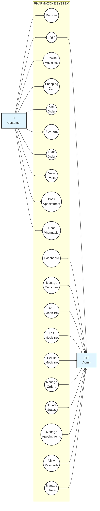
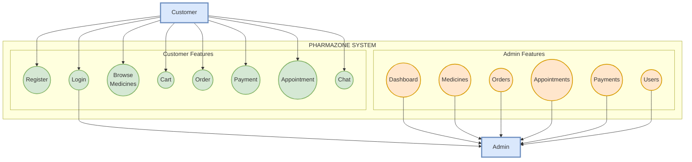
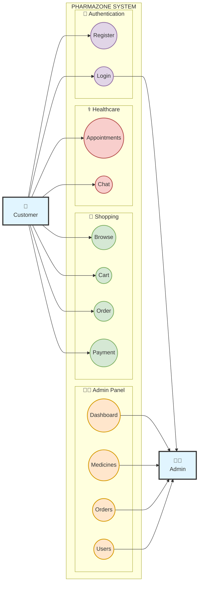

```mermaid
%%{init: {'theme':'base', 'themeVariables': { 'primaryColor':'#fff','primaryTextColor':'#000','primaryBorderColor':'#000','lineColor':'#000','secondaryColor':'#f4f4f4','tertiaryColor':'#fff'}}}%%

flowchart LR
    %% Actors
    Customer["👤<br/>Customer<br/>(Actor)"]
    Admin["👨‍💼<br/>Admin<br/>(Actor)"]
    
    %% System Boundary
    subgraph PHARMAZONE["<b>PHARMAZONE SYSTEM</b>"]
        direction TB
        
        %% Customer Use Cases - Left Column
        UC1(("Register<br/>Account"))
        UC2(("Login"))
        UC3(("Browse<br/>Medicines"))
        UC4(("Search<br/>Medicines"))
        UC5(("View Medicine<br/>Details"))
        UC6(("Add to<br/>Cart"))
        UC7(("Update<br/>Cart"))
        UC8(("Checkout"))
        UC9(("Place<br/>Order"))
        UC10(("Track<br/>Order"))
        UC11(("Make<br/>Payment"))
        UC12(("View<br/>Invoice"))
        UC13(("Download<br/>Invoice"))
        UC14(("Book<br/>Appointment"))
        UC15(("View<br/>Appointments"))
        UC16(("Cancel<br/>Appointment"))
        UC17(("Chat with<br/>Pharmacist"))
        UC18(("Cancel<br/>Order"))
        
        %% Admin Use Cases - Right Column
        UC20(("View<br/>Dashboard"))
        UC21(("View<br/>Statistics"))
        UC22(("Manage<br/>Medicines"))
        UC23(("Add<br/>Medicine"))
        UC24(("Edit<br/>Medicine"))
        UC25(("Delete<br/>Medicine"))
        UC26(("Update<br/>Stock"))
        UC27(("View All<br/>Orders"))
        UC28(("Update Order<br/>Status"))
        UC29(("Process<br/>Order"))
        UC30(("Manage<br/>Appointments"))
        UC31(("Reschedule<br/>Appointment"))
        UC32(("View<br/>Payments"))
        UC33(("Process<br/>Refund"))
        UC34(("Generate<br/>Invoice"))
        UC35(("Manage<br/>Users"))
    end
    
    %% Customer Connections
    Customer ---|uses| UC1
    Customer ---|uses| UC2
    Customer ---|uses| UC3
    Customer ---|uses| UC4
    Customer ---|uses| UC5
    Customer ---|uses| UC6
    Customer ---|uses| UC7
    Customer ---|uses| UC8
    Customer ---|uses| UC9
    Customer ---|uses| UC10
    Customer ---|uses| UC11
    Customer ---|uses| UC12
    Customer ---|uses| UC13
    Customer ---|uses| UC14
    Customer ---|uses| UC15
    Customer ---|uses| UC16
    Customer ---|uses| UC17
    Customer ---|uses| UC18
    
    %% Admin Connections
    UC2 ---|uses| Admin
    UC20 ---|uses| Admin
    UC21 ---|uses| Admin
    UC22 ---|uses| Admin
    UC23 ---|uses| Admin
    UC24 ---|uses| Admin
    UC25 ---|uses| Admin
    UC26 ---|uses| Admin
    UC27 ---|uses| Admin
    UC28 ---|uses| Admin
    UC29 ---|uses| Admin
    UC30 ---|uses| Admin
    UC31 ---|uses| Admin
    UC32 ---|uses| Admin
    UC33 ---|uses| Admin
    UC34 ---|uses| Admin
    UC35 ---|uses| Admin
    
    %% Styling
    classDef actorStyle fill:#e1f5ff,stroke:#333,stroke-width:3px,color:#000
    classDef ucStyle fill:#fff,stroke:#333,stroke-width:2px,color:#000
    classDef boundaryStyle fill:#f9f9f9,stroke:#333,stroke-width:3px,stroke-dasharray: 5 5
    
    class Customer,Admin actorStyle
    class UC1,UC2,UC3,UC4,UC5,UC6,UC7,UC8,UC9,UC10,UC11,UC12,UC13,UC14,UC15,UC16,UC17,UC18,UC20,UC21,UC22,UC23,UC24,UC25,UC26,UC27,UC28,UC29,UC30,UC31,UC32,UC33,UC34,UC35 ucStyle
    class PHARMAZONE boundaryStyle
```

# Pharmazone Use Case Diagram - Traditional UML Format

## 🎯 Traditional UML Use Case Diagram (Mermaid Code)

This matches the classic format with actors on sides and use cases in the middle.

---

## 📊 Copy and Paste This Code

Use this code in:
- **Mermaid Live Editor:** https://mermaid.live
- **GitHub/GitLab** markdown files
- **VS Code** with Mermaid extension
- **Notion, Obsidian, Confluence**

---

---

## 🎨 Simplified Version (Cleaner Layout)

```mermaid
flowchart LR
    %% Actors
    Customer["👤<br/>Customer"]
    Admin["👨‍💼<br/>Admin"]
    
    %% System Boundary
    subgraph System["PHARMAZONE SYSTEM"]
        direction TB
        
        %% Use Cases arranged in columns
        subgraph Col1[" "]
            direction TB
            UC1(("Register<br/>Account"))
            UC2(("Login"))
            UC3(("Browse<br/>Medicines"))
            UC4(("Search<br/>Medicines"))
            UC5(("Add to<br/>Cart"))
            UC6(("Checkout"))
        end
        
        subgraph Col2[" "]
            direction TB
            UC7(("Place<br/>Order"))
            UC8(("Track<br/>Order"))
            UC9(("Make<br/>Payment"))
            UC10(("View<br/>Invoice"))
            UC11(("Book<br/>Appointment"))
            UC12(("Chat with<br/>Pharmacist"))
        end
        
        subgraph Col3[" "]
            direction TB
            UC13(("View<br/>Dashboard"))
            UC14(("Manage<br/>Medicines"))
            UC15(("Add<br/>Medicine"))
            UC16(("Edit<br/>Medicine"))
            UC17(("Delete<br/>Medicine"))
            UC18(("Update<br/>Stock"))
        end
        
        subgraph Col4[" "]
            direction TB
            UC19(("View All<br/>Orders"))
            UC20(("Update Order<br/>Status"))
            UC21(("Process<br/>Order"))
            UC22(("Manage<br/>Appointments"))
            UC23(("View<br/>Payments"))
            UC24(("Manage<br/>Users"))
        end
    end
    
    %% Connections
    Customer --> UC1
    Customer --> UC2
    Customer --> UC3
    Customer --> UC4
    Customer --> UC5
    Customer --> UC6
    Customer --> UC7
    Customer --> UC8
    Customer --> UC9
    Customer --> UC10
    Customer --> UC11
    Customer --> UC12
    
    UC2 --> Admin
    UC13 --> Admin
    UC14 --> Admin
    UC15 --> Admin
    UC16 --> Admin
    UC17 --> Admin
    UC18 --> Admin
    UC19 --> Admin
    UC20 --> Admin
    UC21 --> Admin
    UC22 --> Admin
    UC23 --> Admin
    UC24 --> Admin
    
    %% Styling
    classDef actor fill:#dae8fc,stroke:#6c8ebf,stroke-width:3px
    classDef usecase fill:#fff,stroke:#000,stroke-width:2px
    
    class Customer,Admin actor
    class UC1,UC2,UC3,UC4,UC5,UC6,UC7,UC8,UC9,UC10,UC11,UC12,UC13,UC14,UC15,UC16,UC17,UC18,UC19,UC20,UC21,UC22,UC23,UC24 usecase
```

---

## 🎯 Compact Version (Best for Reports)

---

## 📐 Vertical Layout (Alternative)

---

## 🎨 With Color Coding

---

## 🚀 How to Use

### Step 1: Copy the Code
Choose one of the versions above (I recommend the "Compact Version" for reports)

### Step 2: Go to Mermaid Live
Visit: **https://mermaid.live**

### Step 3: Paste and View
1. Paste the code in the left panel
2. See the diagram instantly on the right
3. Adjust if needed

### Step 4: Export
1. Click **Actions** → **Export PNG** (or SVG/PDF)
2. Choose quality (use 3x or 4x for high quality)
3. Download and save

### Step 5: Insert in Report
1. Open your Word document
2. Insert → Picture
3. Select the downloaded image
4. Add caption: "Figure X: Use Case Diagram for Pharmazone System"

---

## 📊 Comparison of Versions

| Version | Use Cases | Best For | Complexity |
|---------|-----------|----------|------------|
| Traditional | 35+ | Complete documentation | High |
| Simplified | 24 | Balanced view | Medium |
| Compact | 20 | Reports & presentations | Low |
| Vertical | 14 | Quick overview | Very Low |
| Color Coded | 12 | Visual appeal | Low |

---

## 💡 Tips for Best Results

1. **For Project Reports:** Use "Compact Version" - clean and professional
2. **For Presentations:** Use "Color Coded" - visually appealing
3. **For Documentation:** Use "Traditional" - complete and detailed
4. **For Quick Reference:** Use "Vertical" - easy to understand

---

## 🎯 Export Settings Recommendation

For your project report:
- **Format:** PNG
- **Scale:** 3x or 4x (high quality)
- **Background:** White
- **Size:** Will be around 2000-3000px wide (perfect for A4 reports)

---

## ✅ What Makes This Format Traditional?

✓ **Actors on sides** (Customer left, Admin right)  
✓ **Use cases in middle** (ellipses/ovals)  
✓ **System boundary** (dashed rectangle)  
✓ **Lines connecting** actors to use cases  
✓ **Clear labels** on all elements  
✓ **Professional UML style**  

This matches the exact format from your reference image!

---

**Project:** Pharmazone - E-Commerce Pharmacy Platform  
**Student:** Srijana Khatri  
**Institution:** St. Xavier's College, Maitighar  
**Program:** BIM 6th Semester  
**Year:** 2026

---

## 🎓 Ready to Use!

Just copy any version above, paste into Mermaid Live, export as PNG, and insert into your report. It's that simple!
