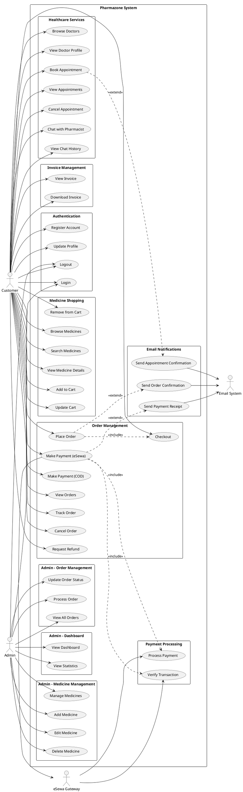

# PHARMAZONE - USE CASE DIAGRAM

## System Boundary: Pharmazone E-Commerce Pharmacy Platform

---

## ACTORS

### Primary Actors:
1. **Customer** - End user who purchases medicines and books appointments
2. **Admin** - System administrator who manages the platform

### Secondary Actors:
3. **eSewa Payment Gateway** - External payment processing system
4. **Email System** - External email notification system

---

## USE CASES

### CUSTOMER USE CASES

#### Authentication & Profile Management
- **UC-001:** Register Account
- **UC-002:** Login
- **UC-003:** Logout
- **UC-004:** Update Profile
- **UC-005:** Reset Password

#### Medicine Shopping
- **UC-006:** Browse Medicine Catalog
- **UC-007:** Search Medicines
- **UC-008:** Filter by Category
- **UC-009:** View Medicine Details
- **UC-010:** Add Medicine to Cart
- **UC-011:** Update Cart Quantity
- **UC-012:** Remove from Cart
- **UC-013:** View Cart

#### Order Management
- **UC-014:** Proceed to Checkout
- **UC-015:** Enter Delivery Address
- **UC-016:** Select Payment Method
- **UC-017:** Place Order
- **UC-018:** Make Payment (eSewa)
- **UC-019:** Make Payment (Cash on Delivery)
- **UC-020:** View Order History
- **UC-021:** View Order Details
- **UC-022:** Track Order Status
- **UC-023:** Cancel Order
- **UC-024:** Request Refund

#### Invoice Management
- **UC-025:** View Invoice
- **UC-026:** Download Invoice PDF

#### Doctor Appointments
- **UC-027:** Browse Doctors
- **UC-028:** View Doctor Profile
- **UC-029:** Check Available Time Slots
- **UC-030:** Book Appointment
- **UC-031:** View My Appointments
- **UC-032:** View Appointment Details
- **UC-033:** Cancel Appointment
- **UC-034:** Reschedule Appointment

#### Pharmacist Chat
- **UC-035:** Start Chat Session
- **UC-036:** Send Message
- **UC-037:** View Quick Responses
- **UC-038:** View Chat History
- **UC-039:** View Past Conversations

---

### ADMIN USE CASES

#### Authentication
- **UC-040:** Admin Login
- **UC-041:** Admin Logout

#### Dashboard & Analytics
- **UC-042:** View Admin Dashboard
- **UC-043:** View Business Statistics
- **UC-044:** View Sales Reports
- **UC-045:** View Revenue Analytics

#### Medicine Management
- **UC-046:** View Medicine List
- **UC-047:** Add New Medicine
- **UC-048:** Edit Medicine Details
- **UC-049:** Delete Medicine
- **UC-050:** Toggle Medicine Status (Active/Inactive)
- **UC-051:** Manage Medicine Categories
- **UC-052:** Update Medicine Stock

#### Order Management
- **UC-053:** View All Orders
- **UC-054:** View Order Details
- **UC-055:** Update Order Status
- **UC-056:** Process Order
- **UC-057:** Mark as Shipped
- **UC-058:** Mark as Delivered
- **UC-059:** Cancel Order
- **UC-060:** Process Refund

#### Appointment Management
- **UC-061:** View All Appointments
- **UC-062:** View Appointment Details
- **UC-063:** Confirm Appointment
- **UC-064:** Reschedule Appointment
- **UC-065:** Cancel Appointment
- **UC-066:** Manage Doctor Schedules

#### Invoice Management
- **UC-067:** View All Invoices
- **UC-068:** Generate Invoice
- **UC-069:** View Invoice Details
- **UC-070:** Download Invoice PDF

#### User Management
- **UC-071:** View All Users
- **UC-072:** View User Details
- **UC-073:** Manage User Accounts

#### Payment Management
- **UC-074:** View Payment History
- **UC-075:** Verify Payments
- **UC-076:** Process Refunds

---

### ESEWA PAYMENT GATEWAY USE CASES

- **UC-077:** Receive Payment Request
- **UC-078:** Authenticate User
- **UC-079:** Process Payment
- **UC-080:** Send Payment Confirmation
- **UC-081:** Send Payment Failure Notification
- **UC-082:** Verify Transaction

---

### EMAIL SYSTEM USE CASES

- **UC-083:** Send Order Confirmation Email
- **UC-084:** Send Payment Receipt
- **UC-085:** Send Appointment Confirmation
- **UC-086:** Send Order Status Update
- **UC-087:** Send Admin Notification (New Order)

---

## USE CASE RELATIONSHIPS

### Include Relationships (mandatory sub-use cases)

1. **UC-017 (Place Order)** includes:
   - UC-014 (Proceed to Checkout)
   - UC-015 (Enter Delivery Address)
   - UC-016 (Select Payment Method)

2. **UC-018 (Make Payment - eSewa)** includes:
   - UC-077 (Receive Payment Request)
   - UC-078 (Authenticate User)
   - UC-079 (Process Payment)
   - UC-082 (Verify Transaction)

3. **UC-030 (Book Appointment)** includes:
   - UC-028 (View Doctor Profile)
   - UC-029 (Check Available Time Slots)

4. **UC-047 (Add New Medicine)** includes:
   - UC-051 (Manage Medicine Categories)

### Extend Relationships (optional extensions)

1. **UC-017 (Place Order)** extends to:
   - UC-025 (View Invoice) - after successful payment
   - UC-083 (Send Order Confirmation Email) - after order placement

2. **UC-018 (Make Payment - eSewa)** extends to:
   - UC-080 (Send Payment Confirmation) - on success
   - UC-081 (Send Payment Failure Notification) - on failure

3. **UC-030 (Book Appointment)** extends to:
   - UC-085 (Send Appointment Confirmation) - after booking

4. **UC-055 (Update Order Status)** extends to:
   - UC-086 (Send Order Status Update) - when status changes

### Generalization Relationships

1. **Make Payment** (parent) generalizes to:
   - UC-018 (Make Payment - eSewa)
   - UC-019 (Make Payment - Cash on Delivery)

2. **View Details** (parent) generalizes to:
   - UC-009 (View Medicine Details)
   - UC-021 (View Order Details)
   - UC-028 (View Doctor Profile)
   - UC-032 (View Appointment Details)

---

## USE CASE DIAGRAM STRUCTURE

```
┌─────────────────────────────────────────────────────────────────────┐
│                    PHARMAZONE SYSTEM                                 │
│                                                                      │
│  ┌──────────────────────────────────────────────────────────────┐  │
│  │                    CUSTOMER FEATURES                          │  │
│  │                                                               │  │
│  │  Authentication:                                              │  │
│  │  • Register Account                                           │  │
│  │  • Login/Logout                                               │  │
│  │  • Update Profile                                             │  │
│  │                                                               │  │
│  │  Medicine Shopping:                                           │  │
│  │  • Browse/Search Medicines                                    │  │
│  │  • View Medicine Details                                      │  │
│  │  • Manage Shopping Cart                                       │  │
│  │                                                               │  │
│  │  Order Management:                                            │  │
│  │  • Checkout & Place Order                                     │  │
│  │  • Make Payment (eSewa/COD)                                   │  │
│  │  • Track Orders                                               │  │
│  │  • Cancel/Refund Orders                                       │  │
│  │                                                               │  │
│  │  Healthcare Services:                                         │  │
│  │  • Book Doctor Appointments                                   │  │
│  │  • Manage Appointments                                        │  │
│  │  • Chat with Pharmacist                                       │  │
│  │                                                               │  │
│  │  Invoice Management:                                          │  │
│  │  • View/Download Invoices                                     │  │
│  └──────────────────────────────────────────────────────────────┘  │
│                                                                      │
│  ┌──────────────────────────────────────────────────────────────┐  │
│  │                     ADMIN FEATURES                            │  │
│  │                                                               │  │
│  │  Dashboard & Analytics:                                       │  │
│  │  • View Business Statistics                                   │  │
│  │  • Sales & Revenue Reports                                    │  │
│  │                                                               │  │
│  │  Medicine Management:                                         │  │
│  │  • Add/Edit/Delete Medicines                                  │  │
│  │  • Manage Categories                                          │  │
│  │  • Update Stock                                               │  │
│  │                                                               │  │
│  │  Order Management:                                            │  │
│  │  • View All Orders                                            │  │
│  │  • Update Order Status                                        │  │
│  │  • Process Orders                                             │  │
│  │                                                               │  │
│  │  Appointment Management:                                      │  │
│  │  • View/Manage Appointments                                   │  │
│  │  • Manage Doctor Schedules                                    │  │
│  │                                                               │  │
│  │  Payment & Invoice Management:                                │  │
│  │  • View Payments                                              │  │
│  │  • Process Refunds                                            │  │
│  │  • Generate Invoices                                          │  │
│  └──────────────────────────────────────────────────────────────┘  │
│                                                                      │
└─────────────────────────────────────────────────────────────────────┘

EXTERNAL ACTORS:
┌──────────────────┐         ┌──────────────────┐
│  eSewa Payment   │         │   Email System   │
│     Gateway      │         │                  │
└──────────────────┘         └──────────────────┘
```

---

## DETAILED USE CASE SPECIFICATIONS

### UC-001: User Registration
- **Actor:** Customer
- **Precondition:** User is not registered
- **Main Flow:**
  1. User navigates to registration page
  2. User enters username, email, password
  3. User selects user type (customer only)
  4. System validates input data
  5. System creates user account
  6. System redirects to login page
- **Postcondition:** User account is created
- **Alternative Flow:** If validation fails, system displays error message

### UC-017: Place Order
- **Actor:** Customer
- **Precondition:** User is logged in and has items in cart
- **Main Flow:**
  1. User proceeds to checkout
  2. User enters/selects delivery address
  3. User selects payment method (eSewa/COD)
  4. System calculates total amount
  5. User confirms order
  6. System creates order record
  7. If eSewa selected, redirects to payment gateway
  8. System generates invoice after payment
- **Postcondition:** Order is placed and invoice is generated
- **Alternative Flow:** If payment fails, order remains pending

### UC-030: Book Doctor Appointment
- **Actor:** Customer
- **Precondition:** User is logged in
- **Main Flow:**
  1. User browses available doctors
  2. User selects a doctor
  3. System displays available time slots
  4. User selects date and time
  5. User fills patient information
  6. User confirms appointment
  7. System creates appointment record
  8. System sends confirmation email
- **Postcondition:** Appointment is booked
- **Alternative Flow:** If time slot is taken, system shows error

### UC-047: Add New Medicine
- **Actor:** Admin
- **Precondition:** Admin is logged in
- **Main Flow:**
  1. Admin navigates to medicine management
  2. Admin clicks "Add New Medicine"
  3. Admin enters medicine details (name, category, price, etc.)
  4. Admin uploads medicine image
  5. Admin sets stock quantity
  6. System validates data
  7. System creates medicine record
- **Postcondition:** New medicine is added to catalog
- **Alternative Flow:** If validation fails, system shows error

### UC-055: Update Order Status
- **Actor:** Admin
- **Precondition:** Admin is logged in, order exists
- **Main Flow:**
  1. Admin views order list
  2. Admin selects an order
  3. Admin views order details
  4. Admin selects new status (confirmed/processing/shipped/delivered)
  5. Admin adds notes (optional)
  6. System updates order status
  7. System creates status history record
  8. System sends email notification to customer
- **Postcondition:** Order status is updated
- **Alternative Flow:** None

---

## ACTOR-USE CASE MATRIX

| Use Case | Customer | Admin | eSewa | Email |
|----------|----------|-------|-------|-------|
| Register Account | ✓ | | | |
| Login/Logout | ✓ | ✓ | | |
| Browse Medicines | ✓ | | | |
| Manage Cart | ✓ | | | |
| Place Order | ✓ | | | ✓ |
| Make Payment | ✓ | | ✓ | ✓ |
| Track Orders | ✓ | | | |
| Book Appointment | ✓ | | | ✓ |
| Chat with Pharmacist | ✓ | | | |
| View Dashboard | | ✓ | | |
| Manage Medicines | | ✓ | | |
| Manage Orders | | ✓ | | ✓ |
| Manage Appointments | | ✓ | | |
| Process Payments | | ✓ | ✓ | |
| Generate Invoices | | ✓ | | |

---

## NOTES FOR DIAGRAM CREATION

### Visual Layout Suggestions:

1. **Place Customer actor on the left side** with all customer use cases in the center-left
2. **Place Admin actor on the right side** with all admin use cases in the center-right
3. **Place eSewa Gateway at the bottom** connected to payment-related use cases
4. **Place Email System at the top** connected to notification use cases

### Grouping Suggestions:

1. Group customer use cases by functionality:
   - Authentication (top)
   - Shopping (upper-middle)
   - Orders (middle)
   - Healthcare (lower-middle)
   - Invoices (bottom)

2. Group admin use cases by functionality:
   - Dashboard (top)
   - Medicine Management (upper-middle)
   - Order Management (middle)
   - Appointment Management (lower-middle)
   - Payment/Invoice Management (bottom)

### Color Coding Suggestions:

- **Customer use cases:** Light blue
- **Admin use cases:** Light green
- **Payment-related use cases:** Light yellow
- **Healthcare use cases:** Light purple
- **System boundaries:** Dark gray

---

## TOOLS FOR CREATING THE DIAGRAM

You can use any of these tools to create the visual diagram:

1. **Draw.io (diagrams.net)** - Free, web-based
2. **Lucidchart** - Professional, cloud-based
3. **Microsoft Visio** - Desktop application
4. **PlantUML** - Text-based UML generator
5. **StarUML** - Professional UML tool
6. **Creately** - Online diagramming tool

---

## PLANTUML CODE (Optional)

If you want to generate the diagram automatically using PlantUML:



---

This comprehensive use case diagram documentation provides everything you need to create a professional UML use case diagram for your Pharmazone project report!
